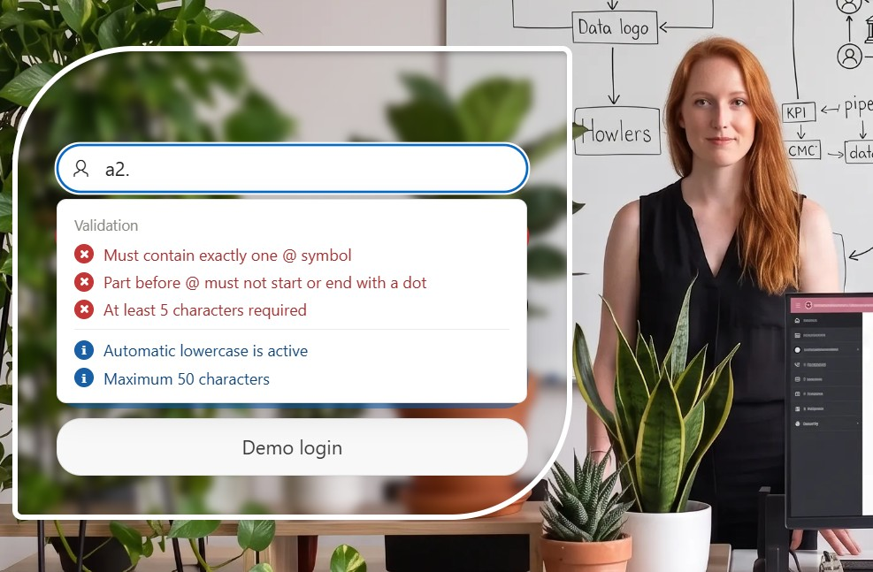
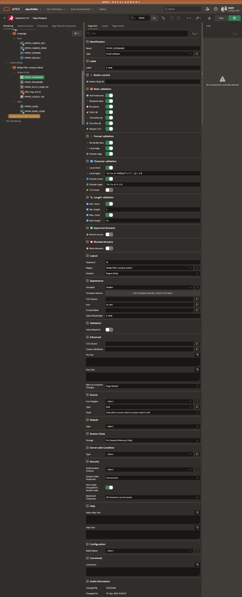
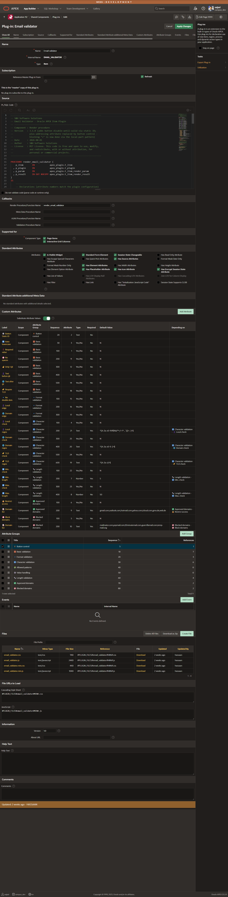

# Email Validator — Oracle APEX Item Plugin


A drop-in replacement for the native APEX **Email** item that validates every rule live in the browser, lists only the *failed* rules in a popover under the field, and can keep a button disabled until the address is valid — no native APEX validation, dynamic action or extra database object required.



---

## ✨ Features

<table border="0">
<tr>
<td width="65%" valign="top">

- 📋 **Live rule popover** — opens on focus and updates on every keystroke; only the rules that currently *fail* are listed, so the box shrinks as the user types
- ✅ **Green confirmation** — as soon as every active rule passes, the list collapses into a single "All validations passed" line
- 🧱 **Structure rules** — exactly one `@`, text before and after the `@`, a required top-level domain, no spaces or control characters
- 🔹 **Format rules** — no consecutive dots, no leading/trailing dot in the local part, no leading/trailing dot or hyphen in the domain
- 🧩 **Regex rules** — validate the local part, the domain and the TLD separately, each with its own pattern and its own on/off switch
- 📏 **Length rules** — independent minimum and maximum length for the complete address, each separately toggleable
- ✅ **Allowed domains** — restrict sign-ups to your own company/partner domains
- 🚫 **Blocked domains** — reject disposable mail providers (`mailinator.com`, `yopmail.com`, …) from an editable list
- 🔡 **Auto lowercase** — normalizes the value while typing, with the caret position preserved
- ⚡ **Button control** — an optional button stays blocked (with a hover hint) until the field is valid, and cooperates with other S&H validators on the same button
- 🌐 **Bilingual** — every rule message, notice and hint ships in German and English, picked from the browser language
- 💾 **Behaves like a normal item** — Session State, Source, Width, Placeholder, Icon and Encrypt all work exactly like the native Email item, and the plugin also runs in **Interactive Grid** columns

</td>
<td width="35%" valign="top">



</td>
</tr>
</table>

---

## 📸 In action

Configured with *Only 1 @*, *Local edge*, a 5-character minimum, a 50-character maximum and auto-lowercase — the popover lists the three unmet rules in red and the two informational notices in blue, and the **Demo login** button below stays blocked until they are all satisfied:


The plugin definition itself, with all 25 configuration attributes grouped by category:



---

## 🚀 Quick start

1. Download [`item_type_plugin_email_validator.sql`](item_type_plugin_email_validator.sql)
2. In your app: **App Builder → Import** → select the file → Type *"Plug-In"* → **Next → Install**
   (or run it with SQLcl/SQL\*Plus connected as the application's parsing schema)
3. Confirm it now appears under **Shared Components → Plug-ins → Email validator**
4. Create (or change) a page item and set **Type** to *Email validator*
5. Configure the attributes described below — every one of them is optional and off by default, so an item with no configuration behaves like a plain text field

That's the whole setup. Nothing needs to be uploaded from `src/` — those files are already embedded inside the `.sql` export above and are delivered through `#PLUGIN_FILES#`.

---

## ⚙️ Attributes

All 25 attributes, in the order they appear in Page Designer. Attributes marked *(depends on …)* are only shown once their switch is enabled.

**⚡ Button control**

| Attribute | Type | Default | Description |
|-----------|------|---------|-------------|
| 🔘 Button Static ID | Text | — | Static ID of a button that stays disabled while the field is invalid. Hovering the blocked button shows a hint box underneath it. Leave empty to turn the feature off — this is client-side convenience only and never replaces server-side validation |

**🧱 Basic validation**

| Attribute | Type | Default | Description |
|-----------|------|---------|-------------|
| 🔡 Auto lowercase | Yes/No | `N` | Converts the value to lowercase while typing. A display convenience, not a rule — it never marks the field invalid |
| ❗ Required value | Yes/No | `N` | Rejects an empty value. When off, an empty field is treated as valid and none of the other rules are evaluated against it |
| 🚫 No spaces | Yes/No | `N` | Rejects spaces and control characters anywhere in the value — `user @example.com` ❌ |
| ☝️ Only 1 @ | Yes/No | `N` | Requires exactly one `@`. Zero or more than one is rejected — `user@@example.com` ❌ |
| 👤 Text before @ | Yes/No | `N` | Requires at least one character in front of the `@` — `@example.com` ❌ |
| 🌐 Text after @ | Yes/No | `N` | Requires at least one character after the `@` — `user@` ❌ |
| 🏷️ Require TLD | Yes/No | `N` | Requires at least one dot after the `@` — `user@localhost` ❌, `user@example.com` ✅ |

**🔹 Format validation**

| Attribute | Type | Default | Description |
|-----------|------|---------|-------------|
| 🔹 No double dots | Yes/No | `N` | Rejects two or more consecutive dots anywhere — `us..er@example.com` ❌ |
| 👤 Local edge | Yes/No | `N` | The part before the `@` must not start or end with a dot — `.user@example.com` ❌ |
| 🌐 Domain edge | Yes/No | `N` | The domain must not start or end with a dot or hyphen — `user@-example.com` ❌ |

**🔤 Character validation**

| Attribute | Type | Default | Description |
|-----------|------|---------|-------------|
| 👤 Local check | Yes/No | `N` | Enables the regex check on the part before the `@` |
| 👤 Local regex | Text | ``^[A-Za-z0-9!#$%&'*+/=?^_`{\|}~.-]+$`` | Pattern the local part must match *(depends on Local check)*. The default is the standard allowed character set **including `+`**, so plus-addressing (`user+tag@example.com`) passes — remove the `+` from the pattern to reject it |
| 🌐 Domain check | Yes/No | `N` | Enables the regex check on the part after the `@` |
| 🌐 Domain regex | Text | `^[A-Za-z0-9.-]+$` | Pattern the domain must match *(depends on Domain check)* — letters, digits, dots and hyphens by default |
| 🏷️ TLD check | Yes/No | `N` | Enables the regex check on the top-level domain (everything after the last dot) |
| 🏷️ TLD regex | Text | `^[A-Za-z]+$` | Pattern the TLD must match *(depends on TLD check)* — letters only by default, so `user@example.123` ❌ |

**📏 Length validation**

| Attribute | Type | Default | Description |
|-----------|------|---------|-------------|
| ⬇️ Min. check | Yes/No | `N` | Enables the minimum-length rule for the complete address |
| 🔢 Min. length | Number | `5` | Minimum number of characters, `@` and domain included *(depends on Min. check)* |
| ⬆️ Max. check | Yes/No | `N` | Enables the maximum-length rule for the complete address |
| 🔢 Max. length | Number | `50` | Maximum number of characters, `@` and domain included *(depends on Max. check)* |

**✅ Approved domains**

| Attribute | Type | Default | Description |
|-----------|------|---------|-------------|
| 🔒 Restrict access | Yes/No | `N` | Only accepts addresses whose domain is on the list below |
| 📝 Domain list | Text | `gmail.com,outlook.com,hotmail.com,yahoo.com,icloud.com,gmx.de,web.de` | Comma-separated domains *(depends on Restrict access)*. Domain names only — no `@`, no protocol, no path |

**🚫 Blocked domains**

| Attribute | Type | Default | Description |
|-----------|------|---------|-------------|
| 🚫 Block domains | Yes/No | `N` | Rejects addresses whose domain is on the list below |
| 📝 Domain list | Text | `mailinator.com,yopmail.com,10minutemail.com,guerrillamail.com,temp-mail.org` | Comma-separated domains to reject *(depends on Block domains)* |

---

## 💡 Usage examples

**Minimal — just make sure it looks like an email address**

```
Required value:   Yes
Only 1 @:         Yes
Text before @:    Yes
Text after @:     Yes
Require TLD:      Yes
```

**Public sign-up form — clean input, no throwaway addresses**

```
Required value:   Yes
Auto lowercase:   Yes
No spaces:        Yes
Only 1 @:         Yes
No double dots:   Yes
Local edge / Domain edge:   Yes
Require TLD:      Yes
Block domains:    Yes   Domain list: mailinator.com, yopmail.com, 10minutemail.com
Min. check: Yes  (Min. length: 6)
Max. check: Yes  (Max. length: 100)
```

**Internal application — company and partner domains only**

```
Required value:    Yes
Restrict access:   Yes   Domain list: company.com, partner.org, university.edu
Only 1 @:          Yes
Require TLD:       Yes
Button Static ID:  NEXT_BTN
```

**Strict format — no plus-addressing, letters-only TLD**

```
Local check:   Yes   Local regex:  ^[A-Za-z0-9._-]+$
Domain check:  Yes   Domain regex: ^[A-Za-z0-9.-]+$
TLD check:     Yes   TLD regex:    ^[A-Za-z]{2,}$
```

The item still behaves like a normal APEX item once configured — the value lands in session state as `:P1_EMAIL` like any other item, and standard attributes (Session State Storage, Encrypt, Source) all apply.

---

## ⚡ How the button control works

Set **Button Static ID** to the Static ID of any button on the page (for example `NEXT_BTN`) and the plugin will:

- add a *blocked* state to that button while the field fails at least one rule — clicks are swallowed in the capture phase, so the button's own `apex.submit` never fires
- show a hint box under the button on hover: *"Please enter a valid email address first"*
- use `aria-disabled` instead of the `disabled` property, so the browser still delivers the hover events the hint depends on
- **ignore a hidden field** — an item sitting inside an unopened inline dialog never blocks a button the user cannot even see the field for; an `IntersectionObserver` re-runs the check the moment the field becomes visible
- **cooperate with other S&H plugins** — if the Email validator and the [Password Validator](https://github.com/Sajjad-786/apex-password-validator) both control the same button, their messages are combined in the button's tooltip and their hint boxes stack underneath each other instead of overlapping

> ⚠️ The blocked button is a UX convenience only. A disabled button can be re-enabled through the browser's developer tools, so the authoritative check must always run server-side.

---

## 🌐 Language

Rule messages, notices and the button hint are shipped in German and English. The language is picked automatically from `navigator.language`: a browser language starting with `de` gets the German texts, everything else gets English. No configuration attribute, no APEX translation setup needed.

---

## 🔒 Security note

Only the plugin's *configuration* is written into `data-*` attributes — never the entered value. The value lives solely in the input element, exactly like a native APEX email item. All client-side checks are UX feedback; the authoritative validation belongs in a server-side APEX validation.

---

## 📋 Requirements

| | |
|---|---|
| Oracle APEX | 23.2 or later |
| Theme | Universal Theme |
| Database objects | None — standard item type plugin |
| Supported components | Page items and Interactive Grid columns |
| Icon fonts | None — every icon in the popover is pure CSS |

---

## 📁 Repository structure

| Path | Contents |
|------|----------|
| `item_type_plugin_email_validator.sql` | APEX plug-in export, ready to import |
| `plsql/` | Render procedure in readable form |
| `src/` | Stylesheet and client-side behavior (source + minified) |
| `screenshots/` | Images used in this documentation |

The files under `src/` are the same code that is embedded in the plug-in export, kept separately so changes stay readable and reviewable in version control.

| Component | Version |
|-----------|---------|
| `email_validator.js` | 3.3.0 |
| `email_validator.css` | 3.2.0 |
| `render_email_validator.sql` | 3.1.0 |

---

## 📄 About

| | |
|---|---|
| Author | [Sajjad Hanifa](https://www.linkedin.com/in/sajjad-hanifa/) |
| Vendor | S&H Software Solution |
| Version | 3.3.0 |
| License | [MIT](LICENSE) |
| Blog | [apexnote.de](https://www.apexnote.de/) |
| YouTube | [APEX-NOTE](https://www.youtube.com/@APEX-NOTE) |

### 🙏 Contributors

Thanks to [Hassaan Ahmed Tahir](https://www.linkedin.com/in/hassaan-ahmed-tahir-5a385b2a1/) for contributing to this plug-in.

### 🔗 Related plug-ins

- [Password Validator](https://github.com/Sajjad-786/apex-password-validator) — live password rule validation, strength meter and one-click generator. Both plug-ins can control the same button side by side.

Found a bug or have a suggestion? Open an [issue](https://github.com/Sajjad-786/apex-email-validator/issues).
